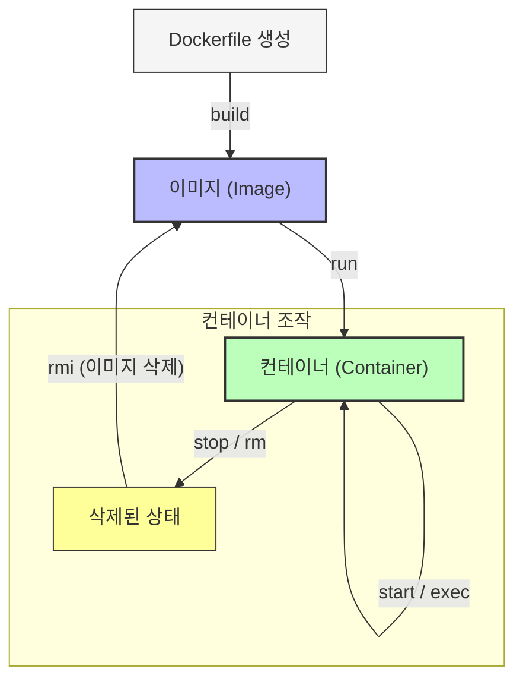

# 🐳 도커(Docker) CLI 가이드

---

Docker는 컨테이너 기반 애플리케이션 개발, 배포, 실행을 위한 플랫폼입니다. 컨테이너는 애플리케이션과 의존성을 패키징하여 환경 간 일관성을 보장합니다. 아래는 Docker CLI 명령어를 **구조적으로 정리**하고, 각 명령어의 사용법, 예제, 핵심 개념을 설명합니다.

---

### 🧩 **기본 흐름 이해하기: 라이프사이클 관리**

컨테이너와 이미지는 도커의 핵심 객체입니다. 이를 다루는 흐름은 다음과 같습니다:



---

## 1. **Docker CLI 기본 구조**

```bash
docker [OPTIONS] COMMAND [ARGUMENTS]

```

- **OPTIONS**: 전역 옵션 (예: `-host`, `-log-level`)
- **COMMAND**: 주요 명령어 (예: `run`, `build`, `ps`)
- **ARGUMENTS**: 명령어에 필요한 인자 (예: 이미지 이름, 컨테이너 ID)

---

## 2. **공통 명령어 (Common Commands)**

| 명령어 | 설명 | 사용 예 |
| --- | --- | --- |
| **`run`** | 이미지로부터 컨테이너 생성 및 실행 | `docker run -d -p 80:80 nginx` |
| **`exec`** | 실행 중인 컨테이너에 명령어 실행 | `docker exec -it my_container bash` |
| **`ps`** | 실행 중인 컨테이너 목록 조회 | `docker ps -a` (정지된 컨테이너 포함) |
| **`build`** | Dockerfile로 이미지 빌드 | `docker build -t my_image .` |
| **`pull`** | 레지스트리에서 이미지 다운로드 | `docker pull ubuntu:latest` |
| **`push`** | 레지스트리에 이미지 업로드 | `docker push my_username/my_image:tag` |
| **`images`** | 로컬 이미지 목록 조회 | `docker images` |
| **`login`** | 레지스트리 인증 | `docker login` |
| **`version`** | Docker 버전 확인 | `docker version` |
| **`info`** | 시스템 정보 표시 | `docker info` |

---

## 3. **관리 명령어 (Management Commands)**

### 3.1 컨테이너 관리 (`docker container`)

| 명령어 | 설명 | 사용 예 |
| --- | --- | --- |
| **`create`** | 컨테이너 생성 (실행 X) | `docker container create nginx` |
| **`start`** | 정지된 컨테이너 시작 | `docker container start my_container` |
| **`stop`** | 실행 중인 컨테이너 정지 | `docker container stop my_container` |
| **`rm`** | 컨테이너 삭제 | `docker container rm my_container` |
| **`prune`** | 사용되지 않는 컨테이너 정리 | `docker container prune` |

### 3.2 이미지 관리 (`docker image`)

| 명령어 | 설명 | 사용 예 |
| --- | --- | --- |
| **`rmi`** | 이미지 삭제 | `docker image rmi my_image` |
| **`prune`** | 사용되지 않는 이미지 정리 | `docker image prune -a` |

### 3.3 네트워크 관리 (`docker network`)

| 명령어 | 설명 | 사용 예 |
| --- | --- | --- |
| **`create`** | 네트워크 생성 | `docker network create my_network` |
| **`connect`** | 컨테이너를 네트워크에 연결 | `docker network connect my_network my_container` |

### 3.4 볼륨 관리 (`docker volume`)

| 명령어 | 설명 | 사용 예 |
| --- | --- | --- |
| **`create`** | 볼륨 생성 | `docker volume create my_volume` |
| **`inspect`** | 볼륨 정보 확인 | `docker volume inspect my_volume` |

### 3.5 기타 관리 도구

- **`docker compose`**: 멀티 컨테이너 애플리케이션 관리 (Docker Compose 파일 사용)
    
    ```bash
    docker compose up -d  # 백그라운드 실행
    
    ```
    
- **`docker inspect`**: 컨테이너/이미지 세부 정보 조회
    
    ```bash
    docker inspect my_container  # JSON 형식으로 정보 출력
    
    ```
    
- **`docker stats`**: 컨테이너 리소스 사용량 실시간 모니터링
    
    ```bash
    docker stats
    
    ```
    

---

## 4. **고급 명령어 (Commands)**

| 명령어 | 설명 | 사용 예 |
| --- | --- | --- |
| **`attach`** | 컨테이너의 스트림에 연결 (입력/출력 공유) | `docker attach my_container` |
| **`commit`** | 컨테이너 변경 사항을 이미지로 저장 | `docker commit my_container my_new_image` |
| **`cp`** | 컨테이너와 로컬 파일 시스템 간 복사 | `docker cp my_container:/app/data .` |
| **`diff`** | 컨테이너 파일 시스템 변경 사항 확인 | `docker diff my_container` |
| **`logs`** | 컨테이너 로그 조회 | `docker logs my_container --follow` |
| **`top`** | 컨테이너 내 실행 중인 프로세스 표시 | `docker top my_container` |
| **`tag`** | 이미지에 태그 추가 | `docker tag source_image target_image:tag` |

---

## 5. **Swarm 명령어 (Orchestration)**

| 명령어 | 설명 | 사용 예 |
| --- | --- | --- |
| **`swarm init`** | Swarm 모드 초기화 (단일 노드 클러스터 생성) | `docker swarm init` |
| **`swarm join`** | Swarm 클러스터에 노드 추가 | `docker swarm join --token  :2377` |
| **`service create`** | Swarm 서비스에 컨테이너 배포 | `docker service create --replicas 3 nginx` |

---

## 6. **전역 옵션 (Global Options)**

| 옵션 | 설명 | 사용 예 |
| --- | --- | --- |
| **`--host`** | Docker 데몬 연결 주소 지정 | `docker --host=tcp://192.168.99.100:2376 images` |
| **`--log-level`** | 로그 레벨 설정 (`debug`, `info`, `warn`, `error`) | `docker --log-level debug info` |
| **`--tls`** | TLS 사용 (보안 연결) | `docker --tls verify images` |
| **`--context`** | 데몬 연결 컨텍스트 지정 | `docker --context my_context run hello-world` |

---

## 7. **핵심 개념 정리**

### 7.1 이미지 vs 컨테이너

- **이미지**: 애플리케이션과 의존성의 정적 템플릿 (예: `nginx:latest`)
- **컨테이너**: 이미지의 실행 인스턴스 (예: `docker run nginx`)

### 7.2 Dockerfile

- 컨테이너 생성을 위한 텍스트 기반 구성 파일
    
    ```
    FROM ubuntu:latest
    RUN apt-get update && apt-get install -y nginx
    CMD ["nginx", "-g", "daemon off;"]
    
    ```
    

### 7.3 레지스트리

- **Docker Hub**: 공식 이미지 저장소 (예: `docker pull nginx`)
- **개인 레지스트리**: `docker login myregistry.com` 후 사용

### 7.4 네트워킹

- 컨테이너 간 통신을 위한 사용자 정의 네트워크 생성
    
    ```bash
    docker network create my_network
    docker run --network my_network --name db mysql
    docker run --network my_network --name app my_app
    
    ```
    

### 7.5 볼륨

- 영구적 데이터 저장 및 공유
    
    ```bash
    docker run -v my_volume:/app/data my_container
    
    ```
    

---

## 8. **실무 팁 및 주의사항**

1. **컨테이너 강제 종료**: `docker stop`이 실패하면 `docker kill` 사용
2. **이미지 태그 관리**: `latest` 태그 대신 의미 있는 버전 태그 사용 (예: `v1.0.0`)
3. **리소스 제한**: `-memory` 및 `-cpus`로 리소스 제한
    
    ```bash
    docker run --memory="512m" --cpus="1" my_container
    
    ```
    
4. **보안**: `-read-only`로 컨테이너 파일 시스템 읽기 전용 설정
5. **디버깅**: `docker inspect`로 네트워크/볼륨 설정 확인

---

## 9. **예시 워크플로우**

```bash
# 1. Dockerfile로 이미지 빌드
docker build -t my_app .

# 2. 이미지 태그 추가 및 푸시
docker tag my_app my_username/my_app:latest
docker push my_username/my_app:latest

# 3. 컨테이너 실행 (포트 매핑 및 볼륨 연결)
docker run -d -p 8080:80 --name my_container -v my_volume:/app/data my_username/my_app

# 4. 로그 확인 및 컨테이너 상태 모니터링
docker logs my_container --follow
docker stats my_container

# 5. 컨테이너 정지 및 삭제
docker stop my_container
docker rm my_container

```

---

이 가이드를 통해 Docker의 핵심 명령어와 개념을 체계적으로 이해하고, 실무에 활용할 수 있습니다. 추가 질문이 있다면 언제든지 문의하세요! 🐳

## 📎 참고: 공식 문서

- 🔗 https://docs.docker.com/
- 커맨드 전체 보기: `docker --help`, `docker --help`

---